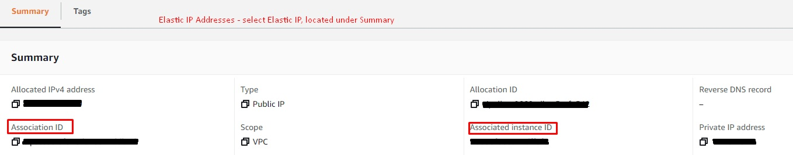
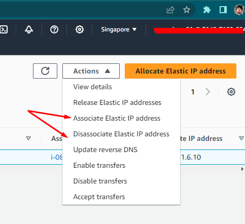
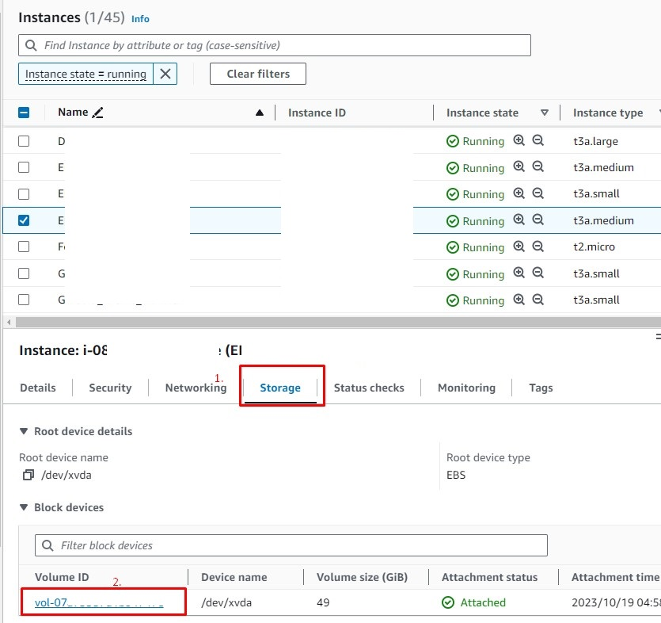
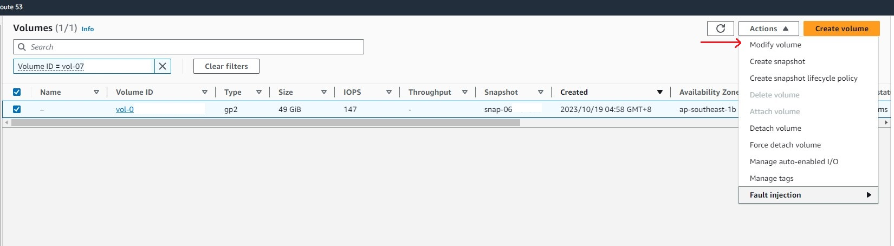
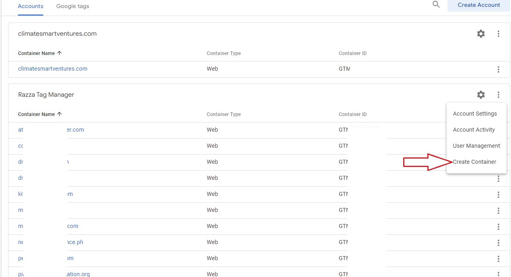

# Infrastructure guides and how-tos/step-by-step

## Restricting IP Addresses from wp-login and whitelisting certain IPs
*This applies to wordpress sites that has php-fpm, fastcgi and NGINX:*

1. Go to /opt/bitnami/nginx/conf/bitnami/conf/php-fpm.conf
2. Add this block of code before the default location block
    ```
    #Restrict logins from unknown IPs in wp-admin and wp-login

    location ~ /(wp-login|wp-admin/) {
        # Allow IPs from
        # Lead Developer
        allow 111.111.22.22;
        # Senior Developer
        allow 111.111.111.142;
        deny all;

    location ~ \.php$ {
        fastcgi_read_timeout 300;
        fastcgi_pass   unix:/opt/bitnami/php/var/run/www.sock;
        fastcgi_index  index.php;
        fastcgi_param  SCRIPT_FILENAME $request_filename;
        fastcgi_hide_header X-Powered-By;
        include        fastcgi_params;

    }
    }
    ```

3. When pasted, should look like this:

    ```
    index index.html index.htm index.php;
    #Restrict logins from unknown IPs in wp-admin and wp-login
    location ~ /(wp-login|wp-admin/) {
        # Allow IPs from
        # Lead Developer
        allow 111.111.22.22;
        # Senior Developer
         allow 111.111.111.142;
        deny all;

    location ~ \.php$ {
        fastcgi_read_timeout 300;
        fastcgi_pass   unix:/opt/bitnami/php/var/run/www.sock;
        fastcgi_index  index.php;
        fastcgi_param  SCRIPT_FILENAME $request_filename;
        fastcgi_hide_header X-Powered-By;
        include        fastcgi_params;

    }
    }

    location ~ \.php$ {
        fastcgi_read_timeout 300;
        fastcgi_pass   unix:/opt/bitnami/php/var/run/www.sock;
        fastcgi_index  index.php;
        fastcgi_param  SCRIPT_FILENAME $request_filename;
        fastcgi_hide_header X-Powered-By;
        include        fastcgi_params;

    }
    ```

4. restart nginx: sudo /opt/bitnami/ctlscript.sh restart nginx

5. If Wordpress site is under apache, not nginx, add these codes to your "/opt/bitnami/apache/conf/bitnami/php-fpm.conf":

    ```
    <Directory "/opt/bitnami/wordpress/wp-admin">
                    Require all denied
                    Require ip 1.2.3.4
    </Directory>
    <Directory "/opt/bitnami/wordpress/wp-login.php">
                    Require all denied
                    Require ip 1.2.3.4
    </Directory>
    ```

*source fix from [How to restrict WordPress Admin Access by IP Address with NGINX](https://www.cloudpanel.io/tutorial/how-to-restrict-wordpress-admin-access-by-ip-address-with-nginx/)*

## Upgrading Bitnami's PHP / Stack

> Watch or follow the steps in the link provided: [Video Link](https://www.youtube.com/watch?reload=9&v=NzjyWlx9h80&t=554s) / [Step-by-step Link](https://www.elasticourse.com/how-to-upgrade-bitnami-wordpress-stack/)

*Link provided for the steps should be the same here*
1. If you are using extended firewall in your application such as Wordfence extended protection, it’s recommended to disable this option temporarily.

2. SSH to the old bitnami server using an SSH client.

3. Stop all services and start mysql or mariadb to do the database backup:

    ```
    sudo /opt/bitnami/ctlscript.sh stop
    sudo /opt/bitnami/ctlscript.sh start mariadb
    sudo /opt/bitnami/ctlscript.sh status
    ```

4. Execute mysqldump command to backup the application database named bitnami_wordpress into a file named mysqldump2023.sql, and enter MySQL/Mariadb root password (located at /home/bitnami/bitnami_credentials):
    ```
    cd /home/bitnami
    sudo mysqldump -u root -p bitnami_wordpress > mysqldump2023.sql
    ```

5. Compress Wordpress main directory while maintaining symlinks:
    ```
    cd /opt/bitnami/wordpress/
    sudo zip -r /home/bitnami/optbitnami.zip * --symlinks
    ```

6. Compress Wordpress media directory:
    ```
    cd /bitnami/wordpress/
    sudo zip -r /home/bitnami/bitnami.zip *
    ```

7. Deploy new bitnami server from AWS marketplace or Lightsail console. Feel free to change CPU, RAM and disk size if you need to. Upload the new instance key file pem into the old server’s /home/bitnami directory. In summary the old server’s /home/bitnami directory should have these following 4 files:
    ```
    cd /home/bitnami
    mysqldump2023.sql
    optbitnami.zip
    bitnami.zip
    newkey.pem
    ```

8. Fix newkey.pem key permissions in old server (*note: if key is currently .ppk, you can execute it on PuTTYgen*):
    ```
    #If file is .ppk, in PuTTygen just go to
    1. Click 'Load'
    2. Enter password if any
    3. Go to 'Conversions' in the ribbon
    4. Click 'Export OpenSSH key'
    5. Save as <your-file-name>.pem

    Then fix new key's permission by executing:
    chmod 600 newkey.pem
    ```
9. Use scp to transfer the backup files from old to new server, where 34.228.112.230 represents new public server IP address. Since scp is an encrypted protocol we are not worried about using the server private IP for file transfer:
    ```
    scp -i newkey.pem optbitnami.zip bitnami@34.228.112.230:/opt/bitnami/wordpress/
    scp -i newkey.pem bitnami.zip bitnami@34.228.112.230:/home/bitnami
    scp -i newkey.pem mysqldump2023.sql bitnami@34.228.112.230:/home/bitnami
    ```
10. SSH to the new bitnami server using an SSH client.
11. Wipe existing Wordpress main directory, then extract the backup zip file:
    ```
    cd /opt/bitnami/wordpress/
    sudo rm -v -r !("optbitnami.zip")
    sudo unzip optbitnami.zip
    sudo rm optbitnami.zip
    ```
12. Navigate to Wordpress media directory, and copy database user info from new wp-config.php before deletion (**IMPORTANT:** *Make sure that the cmd is expanded, or else copied password will be incomplete. Make sure you can see until the close parenthesis + ;*):
    ```
    nano /bitnami/wordpress/wp-config.php

    /** Database username */

    define( 'DB_USER', 'bn_wordpress' );


    /** Database password */

    define( 'DB_PASSWORD', 'r7k80f656c73e22901f8e2e4a25e767d99da60164865fe9f8e2e4a25e76sdfwf' );
    ```
13. Wipe existing Wordpress media directory, then extract the backup zip file:
    ```
    cd /bitnami/wordpress/
    sudo rm -v -r *
    sudo unzip /home/bitnami/bitnami.zip
    rm /home/bitnami/bitnami.zip
    ```
14. Swap database user info from wp-config.php with the ones you copied in previous step:
    ```
    sudo nano /bitnami/wordpress/wp-config.php

    /** Database username */

    - define( 'DB_USER', 'bn_wordpress' );
    + define( 'DB_USER', 'bn_wordpress' );


    /** Database password */
    - define( 'DB_PASSWORD', 'qom2slpozozajid2sufochxxxx48efaaaaaaaaaaaaaaaaaaaaaaaaaaaaaa1hiq' );
    + define( 'DB_PASSWORD', 'r7kxxxxxxxxxxxxxxxxss25e767d99da60aaaaaaaaaaaaaf8e2e4a25e76sdfwf' );
    ```
15. Fix permissions for files and folders
    ```
    cd /opt/bitnami
    sudo chown -R bitnami:daemon wordpress/
    sudo find wordpress/ -type d -exec chmod 775 {} \;
    sudo find wordpress/ -type f -exec chmod 664 {} \;
    cd /bitnami
    sudo chown -R bitnami:daemon wordpress/
    sudo find wordpress/ -type d -exec chmod 775 {} \;
    sudo find wordpress/ -type f -exec chmod 664 {} \;
    sudo chmod 640 wordpress/wp-config.php
    ```

16. Swap MySQL/Mariadb database from backup file, and enter MySQL/Mariadb root password when required (located at /home/bitnami/bitnami_credentials)"
    ```
    mysql -u root -p
    mysql> drop database bitnami_wordpress;
    mysql> create database bitnami_wordpress;
    exit
    mysql -u root -p -D bitnami_wordpress < /home/bitnami/mysqldump2023.sql
    rm /home/bitnami/mysqldump2023.sql
    ```

17. Generate Let’s Encrypt HTTPS certificate:

    ```
    sudo /opt/bitnami/bncert-tool

    Domain List []: domainname.com www.domainname.com
    Enable HTTP to HTTPS redirection (Y\n): Y
    Enable non-www to www redirection (Y\n): Y
    Enable www to non-www redirection (y\N): N

    Do you agree to these changes? [Y\n]:

    Next prompt will ask for the email address, add the site's primary email address or support
    
    Do you agree to the Let's Encrypt Subscriber Agreement? [Y\n]: Y

    Wait for the tool to finish
    It should show success once done.

    Confirm by going to the site, and clicking the padlock icon beside the URL to make sure that you have the certificate you created, date created and validity
    ```

18. Update DNS records to point to the new server public IP.

19. If server/instance is connected to EC2 and it is under Elastic IP, follow [Transferring existing Elastic IP to another instance](#transferring-existing-elastic-ip-to-another-instance)

## Transferring existing Elastic IP to another instance

1. Open the Amazon EC2 console, then select Elastic IPs.
2. Choose the Elastic IP address that you want to transfer.
3. Verify the Association ID and Associated instance ID to confirm which instance the Elastic IP address is currently associated with.

4. Select Actions, Disassociate Elastic IP address.
5. Select Disassociate.
6. Select the Elastic IP address again, and then select Actions, Associate Elastic IP address.

7. Select Instance and then search for the Instance ID of the instance that you want to associate the Elastic IP address with.


## Changing SSH Port
 *applicable to Amazon EC2 and Wordpress Bitnami*
 1. Add the port number to use in EC2's security group
 2. Change SSH default port number by editing the file /etc/ssh/sshd_config
    ``` 
    nano /etc/ssh/sshd_config 
    ```
 3. Find the following line:
    ```
    # Port 22
    ```
4. Uncomment the line and change it to your port number:
    ```
    Port 5437
    ```
5. Restart (this should restart quick)
    ```
    systemctl restart ssh
    ```
6. Next, verify the SSH listening port with the following command:
    ```
    netstat -plntu | grep 5437
    ```
7. You should see the following output:
    ```
    tcp        0      0 0.0.0.0:5437            0.0.0.0:*               LISTEN      5134/sshd       
    tcp6       0      0 :::5437                 :::*                    LISTEN      5134/sshd  
    ```
8. DO not disconnect your current connection yet, and try another connection by testing your new port number, if it works, your old port number shouldn't work. If it doesn't work, check your firewall or your security group and make sure the port number is exposed on either the firewall or security group in EC2


## Backing up Wordpress Site/public_html folder via All-in-One Migration unlimited paid plugin
1. If All-in-one plugin is not installed yet, download the extension plugin and the plugin in the Razza Tech Drive:
    - Go to Razza Shared Drive in Google drive, and go to folders Softwares > Plugins.
    - Install by going to Wordpress Plugins > Add New
    - Proceed installing the 2 plugins *(.zip)*

2. Click All-in-One WP Migration
3. Click Export to > Click File
4. Wait for it to finish

## Restoring Wordpress Site/public_html folder via All-in-One Migration unlimited paid plugin
1. Get backup-file.wpress

2. Click All-in-One WP Migration
3. Click Import > Click File
4. Wait for import to finish
5. Click 'yes', by clicking yes it means you are agreeing that previous site will be lost and be replaced by the new site/backup that is imported.

## Adding storage to Amazon EC2 instance
1. Go to the instance that needs storage upgrade
2. Click Storage below
3. Click Volume ID
4. Select Volume

5. Select Actions dropdown
6. Click Modify Volume

7. Select an appropriate volume required for your server/instance
8. Make sure you get to restart/reboot the instance by right clicking in your instance then click Reboot Instance to refresh the storage previously assigned
9. To check current storage, if storage is updated, go to your SSH and type 'df -h'
    - df shows bytes
    - adding -h parameter makes it human readable

## Adding Google Analytics, Google Search Console to your new Wordpress Site
1. Install Google Site Kit and follow the on-screen prompt to activate Google Analytics, Google Search Console.
2. Make sure you are an admin on the Google Analytics you are adding, lacking authorization will restrict you from having Google Analytics on your website, or you can add instead your own Google Analytics (not recommended on Razza Projects)

## Adding Google Tag
3. Add Google Tag by going to https://tagmanager.google.com/#/home
4. Click on the Account's elipsis
5. Click on 'Create Container'

6. Follow and fill out required fields
7. 2 ways, add your code into Elementor or directly to wordpress file
8. Adding to Wordpress file:
    - Go to your SFTP/SSH and modify header.php
    - Paste Google Tag Header code provided upon finishing submission
    - Paste Google Tag Body code provided upon finishing submission
